<!-- ============================================================== -->
<!--  Mandar Tabib · GitHub profile README                          -->
<!--  Assets live in ./assets ; the REPOS / VIDEOS blocks are        -->
<!--  refreshed daily by .github/workflows/update-readme.yml         -->
<!-- ============================================================== -->

  

  

   
   <!--
   -->
  

  
  
  
  
  
  

---

## 👋 About me

## About Me
- **Purpose:** Facilitate **Research Collaborations and Knowledge Exchange** by Disseminating my peer-reviewed research involving AI + Physics in different Engineering and Scientific Domains. 
- **Content:** This README provides an overview of my research results/figures and introduces me. The computational methods/tolls developed, and technical challenges faced while providing solutions in specific application areas are mentioned below. My research involved fruitful collaborations as shown in publications and acknowledgements. 
- **Position:** Senior Research Scientist, Computational Science and Engineering, **SINTEF Digital**, Trondheim, Norway.
- **My Organisation:** SINTEF is one of Europe's largest independent research organisations, with **2,000+ employees**.
- **Research experience:** Nearly **two decades of research experience**, including my Ph.D. and Master's research with AI and Physics.
- **Core focus:** Development of computational tools that combine:
  - **Artificial Intelligence (AI) and Machine Learning**
  - **Physics-based modelling and numerical simulation**
  - **Hybrid analytics and modelling**, combining data-driven and physics-based approaches to mitigate challenges related to Generalization, Interpretability, Sparse and Noisy data quality, Uncertainty Quantifications, Accuracy and Efficiency. Methods mentioned below.
  - **Agentic AI in 2026, and Generative AI**,
- **Digital engineering:** Integration of these methods into **digital twins, simulation workflows, and Industry 4.0 applications**.
- **Application domains:** My research has been applied across several domains, including:
  - Energy
  - Process industry, including chemical, oil & gas
  - Defence and Aviation Safety
  - Autonomous systems (Drones and Ships)
  - Material Science (Material Discovery)
  - Smart cities
  - Health
- **Research outputs:** The work presented here is predominantly based on my **peer-reviewed scientific publications**, with references provided throughout this repository.
- **Research overview:** My current research can broadly be organised into **three interconnected areas**, described in the following sections together with examples of the computational tools, methods, and domains in which they have been applied.

<table>
<tr>
<td width="33%" valign="top">
<h3 align="center">🧠 Artificial Intelligence</h3>
<small>
  <ul>
    <li>From Traditional machine learning (Regression with Regularizations, Random Forest, SVM)</li>
    <li>To Modern Deep learning (CNN, LSTM, Transformers, GANs, Diffusion)</li>
    <li>Reinforcement learning with safety filters</li>
    <li>Gaussian processes & uncertainty-aware AI</li>
    <li>Explainable AI (SHAP)</li>
    <li><b>Recently, Agentic AI & LLMs</b> for scientific workflows</li>
  </ul>
</small>
</td>
<td width="33%" valign="top">
<h3 align="center">⚛️ Hybrid Modelling (Physics + AI)</h3>
<small>
  <ul>
    <li>Physics-informed NNs for inductive bias</li>
    <li>Learned corrections of imperfect physics</li>
    <li>Learned Low-Dimensional Manifolds and Parametric reduced-order models (POD, autoencoders, Grassmann manifolds)</li>
    <li>Equation discovery (SINDy, symbolic regression)</li>
    <li>Combining ML with traditional data assimilation (Kalman Filters)</li>
    <li>Optimal sensor placements</li>
    <li>Uncertainty Quantification</li>
  </ul>
</small>
</td>
<td width="33%" valign="top">
<h3 align="center">🌊 Numerical methods and Computational Fluid Dynamics</h3>
<small>
  <ul>
    <li>LES / RANS turbulence modelling</li>
    <li>Multiphase & reactive flow modelling</li>
    <li>Discrete Element Modelling</li>
    <li>Turbine models: Actuator-line & sliding-mesh wind turbines</li>
    <li>Multiscale (meso-to-micro) modelling applied to:
      <ul>
        <li>Atmospheric flows</li>
        <li>Reactor design</li>
      </ul>
    </li>
  </ul>
</small>
</td>
</tr>
</table>

## 🧰Method toolbox: Hybrid Analysis & Modelling, and Agentic AI.

<table>
<tr>
<td width="42%" align="center">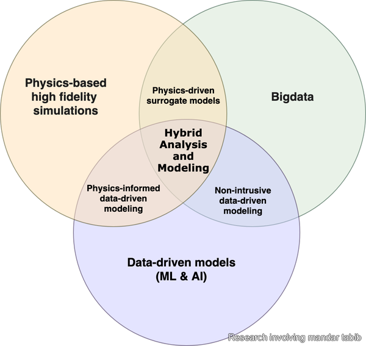</td>
<td width="58%" valign="top">

| HAM method | Where I've used it |
|---|---|
|**Agentic AI**: LLM orchestration + verifiers | Wind farm, Aluminium Industry, Autonomous Ships, **Agentic CFD (OpenFOAM)** |
| Physics-guided ML and Physics-informed Neural Networks |  Wind energy |
| Uncertainty Quantification in ML (incl. Bayesian UQ) |  Pore pressure prediction|
| **Learned correction** of imperfect physics | Drilling models , Aviation: Wake-vortex models. |
| **Parametric ROM**: POD / autoencoder + LSTM / Neural ODE / Grassmann | Wind energy, Urban flow - Smart City, H₂ storage |
| **Equation discovery**: SINDy, symbolic regression | Aluminium process (COSTA-SINDy), Turbine noise |
| **Sparse sensing** & optimal sensor placement | Greenhouse, Ship engine |
| **Safe RL** with predictive safety filters | Drone path planning, Autonomous Vessels, Defense |
| **Generative AI** super-resolution (GAN, diffusion) | Wind-field state estimation |
| **ML data assimilation**: EnKF + nudging | Aviation wake vortices |
</td>
</tr>
</table>

> **Recent focus (2025–2026):** testing and integrating **Agentic AI and Generative AI with hybrid models / scientific ML**. LLM agents *orchestrate* physics models, surrogates, optimisers and verifiers, while the physics-based components remain authoritative.

## Application Area, Tool Developed, Purpose and Challenges mitigated.

<table>
<tr><th width="18%">Section</th><th width="36%">Tools used (AI, Novel hybrid, CFD, physics-based)</th><th width="30%">Benefit / purpose</th><th width="16%">Challenges (see key)</th></tr>
<tr><td valign="top"><a href="#wind-and-renewable-energy"><b>Wind energy</b></a></td><td valign="top"> CFD with actuator line, sliding mesh,  AI tools: POD and conv-autoencoder + LSTM / Neural-ODE for reduced-order models  GAN based super-resolution  Reinforcement Learning   Gaussian processes Autoencoder + GMM + LSTM (on SCADA data)</td><td valign="top">1000–10,000× faster simulation State estimation and super-resolution Wake-steering optimisation and control Predictive maintenance Uncertainty quantification</td><td valign="top">A1 A2 A4 A6 A10 P1 P2 P3 P7 P8</td></tr>
<tr><td rowspan="6" valign="top"><a href="#process-industry-and-oil-and-gas"><b>Process industry</b></a></td><td valign="top"><b>Industry 4.0 / agentic workflows</b> LLM agents, RAG, tool calling Verifier / critic agents Physics models and surrogates as tools</td><td valign="top">Automation Optimisation Decision support</td><td valign="top">A8 A11 P8</td></tr>
<tr><td valign="top"><b>Chemical / multiphase</b> Multiphase CFD: Euler–Euler involving LES with sub-grid models CFD-DEM  Data Analysis: POD + wavelets</td><td valign="top">Closure models Flow-structure insight Equipment design</td><td valign="top">P3 P5 P7 P8 P9</td></tr>
<tr><td valign="top"><b>Aluminium electrolysis</b>  Solving ODEs and Hybrid models (COSTA-SINDy, COSTA-DDM) LLM optimiser agent</td><td valign="top">Optimisation Simulator arbitration</td><td valign="top">A1 A11 P3 P4</td></tr>
<tr><td valign="top"><b>Reactor design, low-carbon and H₂</b> Physics: CFD-DEM + 1D multiscale particle-reactor model AI: POD-LSTM surrogate</td><td valign="top">Closure relations Design choice Fast state estimation</td><td valign="top">A1 A4 P3 P7 P8</td></tr>
<tr><td valign="top"><b>Oil &amp; gas drilling</b> 1D cuttings-transport model + LSTM / Transformer learned correction (intrusive and non-intrusive) Bayesian PINN Isolation Forest, LSTM autoencoder Continual learning</td><td valign="top">Closure in physics Parameter estimation Uncertainty quantification Anomaly detection Pore-pressure prediction</td><td valign="top">A2 A3 A4 A9 A12 P1 P3 P4</td></tr>
<tr><td valign="top"><b>Greenhouse (digital-twin enabler)</b> CFD, POD + QR sensor placement LSTM surrogate RL / MPC, LLM agents Unity 3D, IoT</td><td valign="top">State estimation from ~10 sensors Control What-if analysis</td><td valign="top">A1 A2 P1 P6</td></tr>
<tr><td rowspan="3" valign="top"><a href="#drones-and-autonomous-ships"><b>Defense</b></a></td><td valign="top"><b>Drones</b> Multiscale CFD (SIMRA, LES) Grassmann deep-learning ROM RL path planning</td><td valign="top">Real-time turbulence prediction Risk-aware path planning Control</td><td valign="top">A1 A10 P1 P2 P7</td></tr>
<tr><td valign="top"><b>Autonomous vessels</b> ML-Kalman sensor fusion RL + predictive safety filter LSTM remaining-useful-life Multi-agent LLM (ShipAgent)</td><td valign="top">Collision avoidance (COLREGS) Predictive maintenance RAMS trade-offs</td><td valign="top">A3 A10 A11</td></tr>
<tr><td valign="top"><b>Aviation safety</b> Terrain / building CFD (LES, RANS) Galerkin ROM + EnKF + LSTM nudging</td><td valign="top">Hazard assessment Data assimilation Real-time vortex tracking</td><td valign="top">A2 A7 P1 P2 P3 P6</td></tr>
<tr><td valign="top"><a href="#material-science"><b>Material science</b></a></td><td valign="top">Random Forest vs deep neural network on DFT dataset </td><td valign="top">Accelerated Screening of thermoelectric candidates at ~2 % of DFT cost Accelerated discovery</td><td valign="top">A1 A3 A4 P8</td></tr>
<tr><td valign="top"><a href="#smart-city-urban-climate-mobility-and-health"><b>Smart city</b></a></td><td valign="top">LASSO / Ridge, SVR, Random Forest, ANN, LSTM CFD thermal comfort (PMV) Nested LES / RANS urban wind</td><td valign="top">Interpretable mobility drivers Planning of infrastructure Urban-wind assessment</td><td valign="top">A3 A4 A8 P1 P2</td></tr>
<tr><td valign="top"><a href="#smart-city-urban-climate-mobility-and-health"><b>Health</b></a></td><td valign="top">CFD + unsupervised ML (POD) of carotid-artery flow</td><td valign="top">Insight into disease progression</td><td valign="top">A1 P1 P2 P9</td></tr>
</table>

<b>🔑 Key to the challenge numbers</b>

**A: AI / data-driven challenges**
**A1** sparse or limited data · **A2** noisy or uncertain data · **A3** imbalanced or biased data · **A4** bias vs variance, generalisation · **A5** hyper-parameter sensitivity · **A6** training instability / convergence (incl. GAN mode collapse) · **A7** physical consistency of predictions · **A8** interpretability and trust · **A9** data / concept drift · **A10** safety and reliability of learned control (RL) · **A11** LLM-agent latency, cost, reproducibility, context drift · **A12** multi-modal and multi-fidelity data fusion

**P: physics-based-model challenges**
**P1** uncertain initial / boundary conditions · **P2** geometry and meshing · **P3** incomplete physics and closure (turbulence, inter-phase forces) · **P4** unknown or uncalibrated parameters · **P5** stiffness, numerical stability and convergence · **P6** ill-posed inverse problems · **P7** multiscale / multi-physics coupling · **P8** computational cost (limits real-time use) · **P9** scarce validation data

Challenge numbers mark the ones most relevant to each piece of work, not an exhaustive list. Click a section name to jump to its results.

  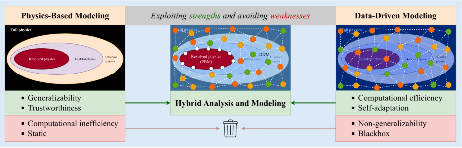
   <i>Hybrid Analysis & Modelling (HAM): generalisable and trustworthy like physics, efficient and self-adapting like AI (after Rasheed et al. 2020).</i>

---

## 🧭 Application domains: jump to the results

<table align="center">
<tr>
<td align="center" width="20%"><a href="#agentic-ai-and-hybrid-modelling-four-cases">🤖 <b>Agentic AI &amp; Hybrid Modelling</b></a></td>
<td align="center" width="20%"><a href="#wind-and-renewable-energy">🌬️ <b>Wind &amp; Renewable Energy</b></a></td>
<td align="center" width="20%"><a href="#low-carbon-process-design-and-hydrogen">💧 <b>Low-Carbon Process Design &amp; Hydrogen</b></a></td>
<td align="center" width="20%"><a href="#digital-twin-enablers-greenhouse-example">🌱 <b>Digital Twin Enablers (Greenhouse)</b></a></td>
<td align="center" width="20%"><a href="#process-industry-and-oil-and-gas">🏭 <b>Process Industry &amp; Oil-Gas</b></a></td>
</tr>
<tr>
<td align="center" width="20%"><a href="#aviation-safety-and-defense">✈️ <b>Aviation Safety &amp; Defense</b></a></td>
<td align="center" width="20%"><a href="#drones-and-autonomous-ships">🚁🚢 <b>Drones &amp; Autonomous Ships</b></a></td>
<td align="center" width="20%"><a href="#smart-city-urban-climate-mobility-and-health">🏙️ <b>Smart City &amp; Health</b></a></td>
<td align="center" width="20%"><a href="#material-science">🔬 <b>Material Science</b></a></td>
</tr>
</table>
  <!--
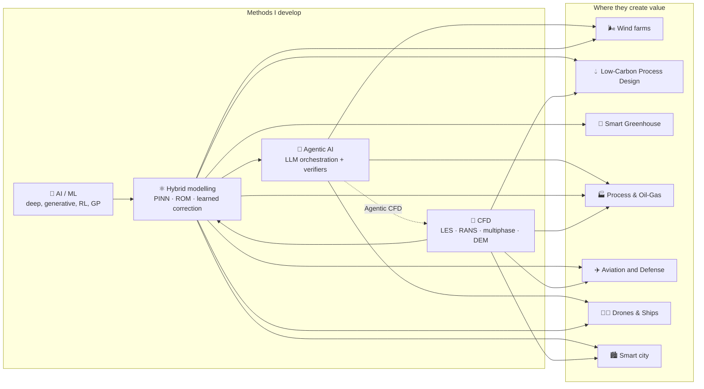
```mermaid
flowchart LR
  subgraph M["Methods I develop"]
    A["🧠 AI / ML<br/>deep, generative, RL, GP"]
    H["⚛️ Hybrid modelling<br/>PINN · ROM · learned correction"]
    C["🌊 CFD<br/>LES · RANS · multiphase · DEM"]
    G["🤖 Agentic AI<br/>LLM orchestration + verifiers"]
  end
  subgraph D["Where they create value"]
    W["🌬️ Wind farms"]
    Hy["💧  Low-Carbon Process Design"]
    Gh["🌱 Smart Greenhouse"]
    P["🏭 Process & Oil-Gas"]
    Av["✈️ Aviation and Defense"]
    Au["🚁🚢 Drones & Ships"]
    S["🏙️ Smart city"]
  end
  A -->  H
  C --> H
  H --> G
  G --> W & P & Au
  G -. "Agentic CFD" .-> C
  H --> W & Hy & Gh & P & Av & Au & S
  C --> Hy & P & Av & S
```

---
-->

## Agentic AI and Hybrid Modelling: Four Cases

**Question:** *Can LLM-based agents automate physics-based engineering workflows, and can local open-weight LLMs replace costly closed models?*
We tested this on four cases, from industrial operations to fully agentic CFD simulation, all following a **propose → verify → constrain** pattern.

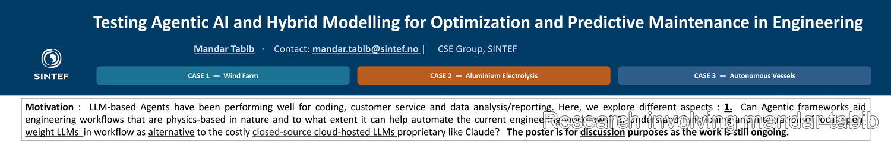

The figures for Cases 1–3 are panels cut from the A1 poster *"Testing Agentic AI and Hybrid Modelling for Optimization and Predictive Maintenance in Engineering"*. **Click any panel to enlarge it.**

### Case 1 · Wind farm: optimisation and predictive maintenance

A nine-module pipeline: live weather data (yr.no API + BM25/RAG search) → critical turbine pairs → **parametric ROM of the wake (10,000× faster than CFD)** → **Gaussian-process power prediction with confidence bounds** → wake-steering optimisation, with an LLM choosing and iterating the optimiser via tool calls.
- ✅ Classical ML pipeline (Autoencoder + GMM health states + gradient-boosting classifier + RNN RUL + SHAP) **outperformed a local LLM with tools** for SCADA fault diagnosis
- ✅ LLM used as Orchestrator, recommendor, critic agents that are run in advisory or blocking mode with physics checks.

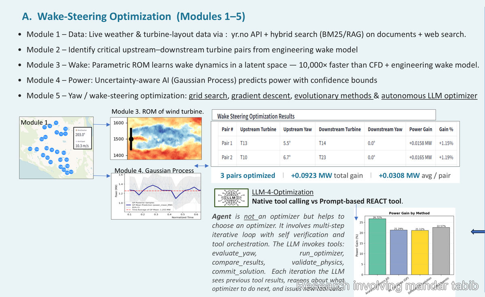

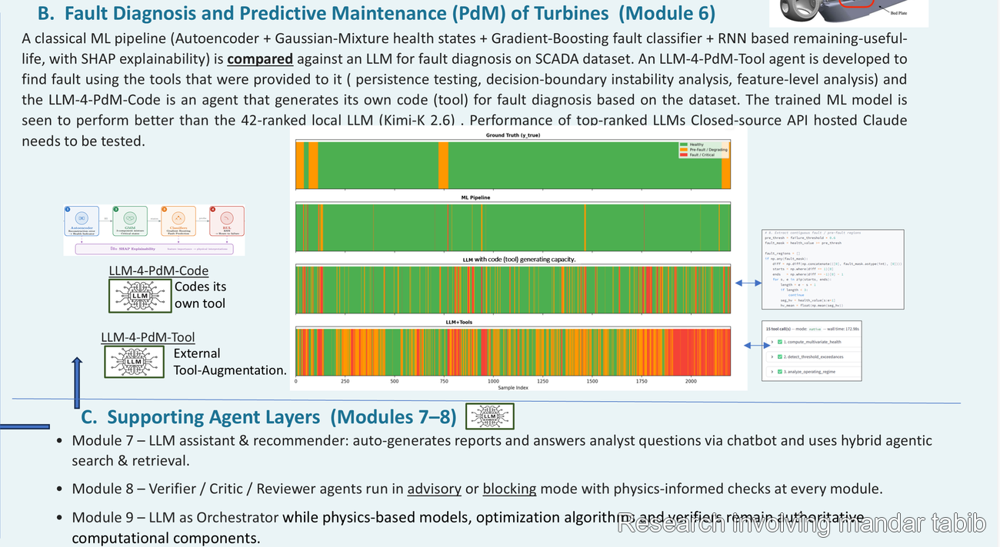

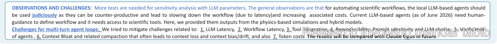

**Agents in optimisation (LLM-4-Optimization).** The agent is *not* the optimiser; it *chooses* one. In a multi-step loop with self-verification it calls `evaluate_yaw`, `run_optimizer`, `compare_results`, `validate_physics` and `commit_solution`, reasoning over earlier results before each new call. We compared native tool calling with prompt-based ReAct.

**Agents in predictive maintenance.** **LLM-4-PdM-Code** writes its own diagnostic code (its own tool) from the SCADA data. **LLM-4-PdM-Tool** uses external tools we provide: a persistence test, decision-boundary instability analysis, feature-level analysis and a SHAP consistency check. The LLM's reasoning is logged for audit.

---

### Case 2 · Aluminium electrolysis: agentic process optimisation

An LLM agent sets the anode–cathode distance to minimise energy while keeping the process stable. It chooses between four simulators: physics ODE, neural, and two hybrids (COSTA-SINDy and COSTA-DDM).
- ✅ Modest accuracy gain and **~10× lower run-to-run variance** than rule-based search
- ⚠️ **~800× longer wall-clock** (275 s vs 0.3 s per run), mostly from LLM latency. This is an honest lesson on where agents pay off.

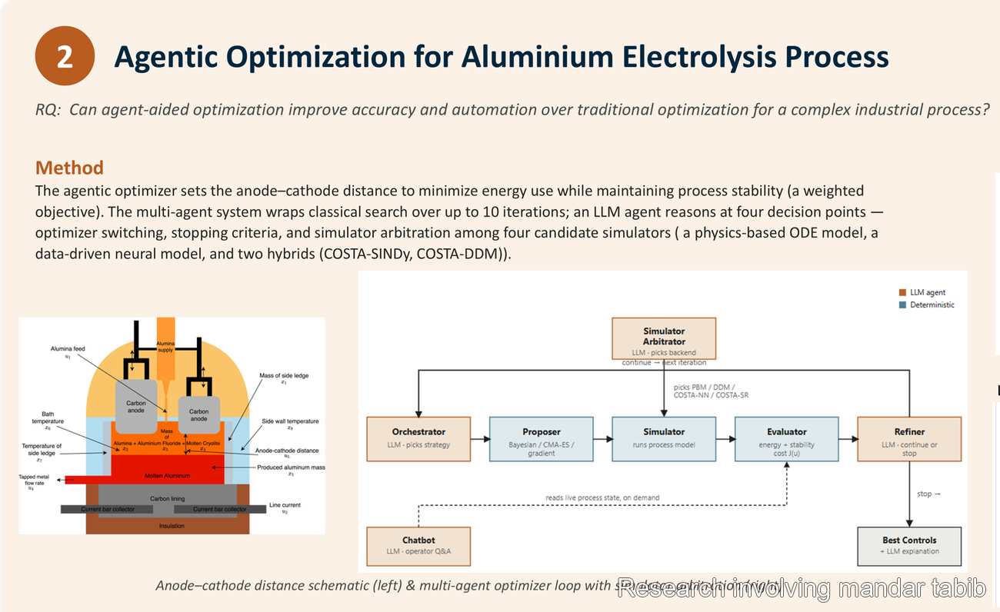

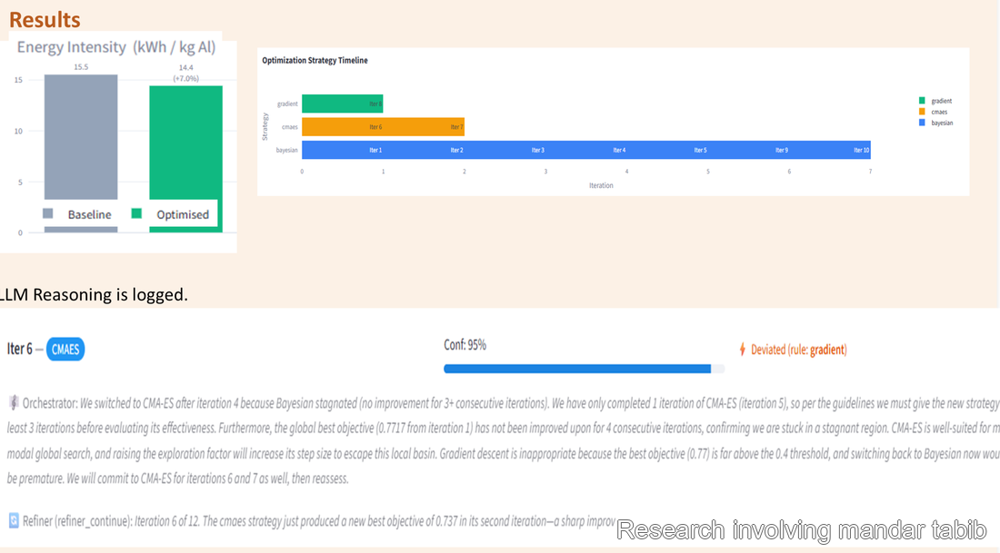

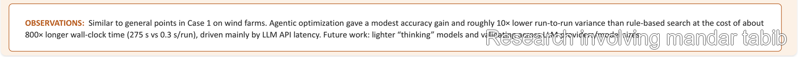

---

### Case 3 · ShipAgent: Multi-agent RAMS for autonomous vessels

An LLM RAMS supervisor coordinates Reliability (LSTM-RUL), Availability, Maintainability and Safety agents over an ML-Kalman sensor-fusion layer. Collision avoidance combines a **COLREGS rule lookup** with an **RL policy guarded by a Predictive Safety Filter**, which escalates from speed reduction to steering correction, then override, then emergency stop.

🔗 **Code:** [PowerLift-WindTurbine](https://github.com/mandar-tabib-1/PowerLift-WindTurbine) · [ShipAgent-RAMS](https://github.com/mandar-tabib-1/ShipAgent-RAMS) · 🌐 [Live demo: agentic wind farm](https://agenticwindfarm.streamlit.app/)

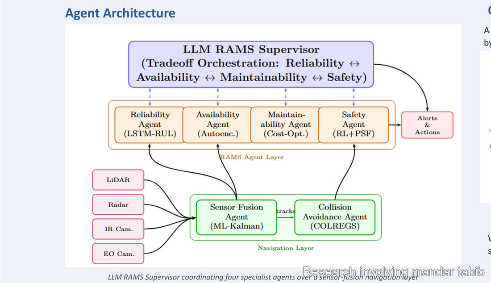

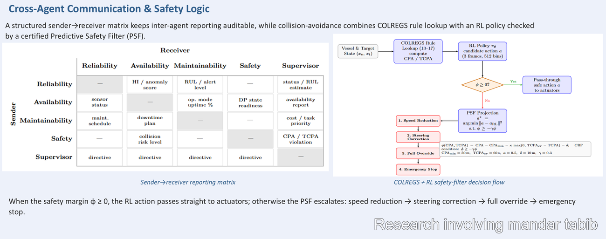

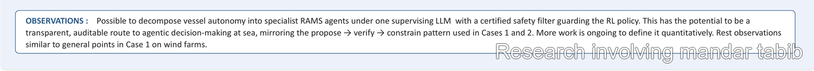

---

### Case 4 · Agentic Simulation with Agentic CFD
*(in collaboration with NTNU: Mikael Shahly , Adil Rasheed, Vasileios Tsiolakis and myself with SEP funding.)*

*Can a team of AI agents, supervised by a human, take a fluid-flow simulation from a one-sentence request to a validated result?*
Built on the **Claude Agent SDK** with **OpenFOAM** and **ParaView**, **AgenticCFD** chains four pipeline agents: **Specification → Case Builder → Mesh → Improvement**. A user approval gate follows each agent. Three fresh-context subagents are on call: an **adversarial critic** briefed to *fail* each mesh and result, a CFD hand, and a source explorer. The design is cybernetic: one feedback loop closed three times, as agent ↔ case, critic ↔ builder, and user ↔ agents. Every number in the specification carries a provenance tag (`[ASSUMED]`, `[INFERRED]`, `[COMPUTED]`, `[REVISED]`, `[RETRACTED]`).

| Case (increasing difficulty) | Result vs trusted reference |
|---|---|
| 🔵 **Cylinder** ("I want to do a simulation of flow past a cylinder") | drag within **2.0 %**, shedding frequency within **0.3 %** of benchmark; all 5 spec criteria met |
| 🟣 **NASA wall-mounted hump** (strong separation, 175k-cell wall-resolved mesh, 2 turbulence models) | reattachment within **0.4 %** of NASA's reference solution |
| 🟢 **Industrial pipe flange, 3D** (no published answer) | validated by self-consistency: mesh refinement until Δp converges, plus mass-balance and wall-resolution checks; a split verdict reported honestly |
| 🟠 **E779A rotating propeller** (blade rebuilt from tables) | thrust within **1.7 %** of experiment, up from 38 % off after the agent found a bug in its *own* geometry code |

✅ Every case was driven by **a user with no prior CFD background**, and the agents found and cited the reference data themselves. The agents also caught a physically impossible request (vortex shedding at Re < 40) and refused an unsuitable meshing tool after checking the source.

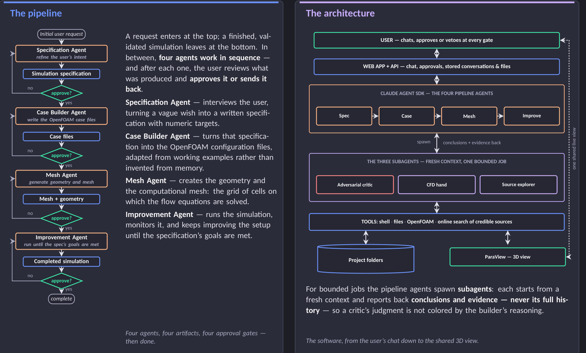 
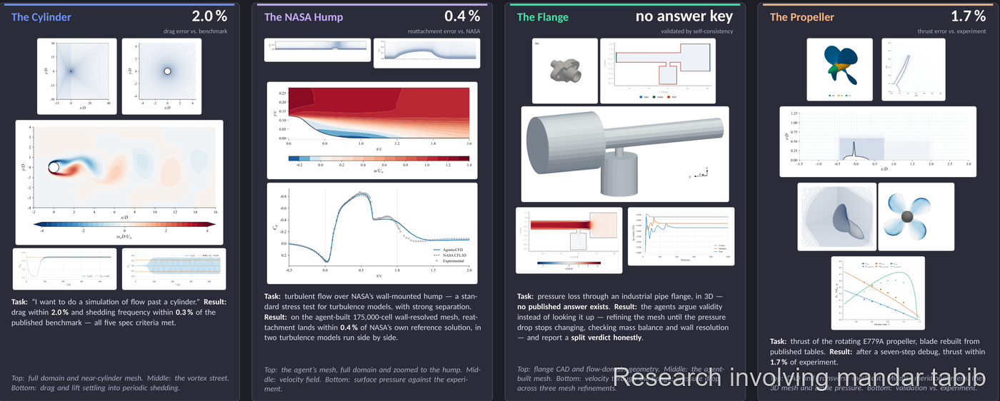 
AgenticCFD: the pipeline with four approval gates, the software architecture, and the four validation case studies.

<b>📊 Show more: AgenticCFD feedback loops, ML vs LLM fault diagnosis, optimiser comparison</b>

 

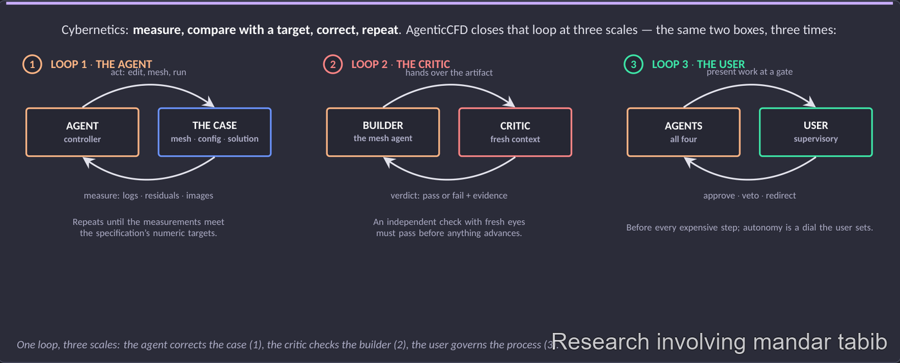 
AgenticCFD's cybernetic idea: the agent corrects the case (1), the critic checks the builder (2), and the user governs the process (3).  
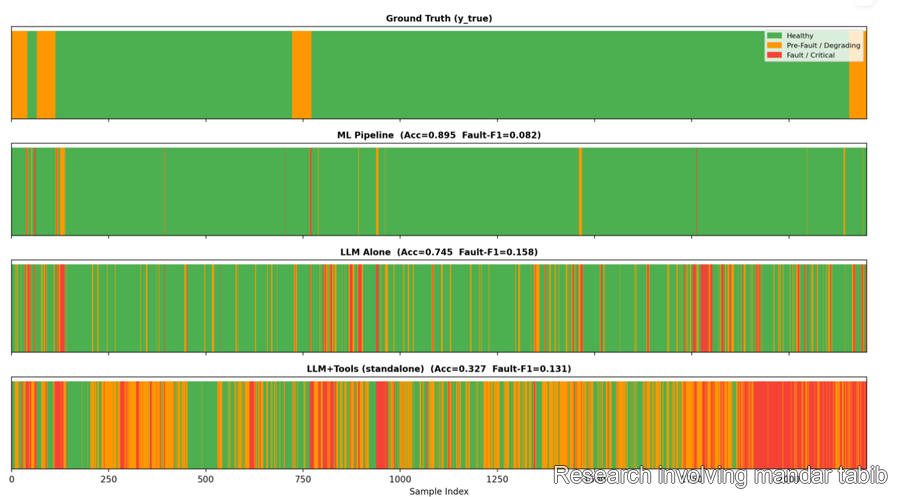 
Ground truth vs ML pipeline vs LLM-alone vs LLM+tools on an unseen turbine (SCADA data).  
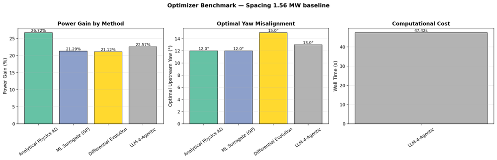 
Power gain, optimal yaw and computational cost for analytical, ML-surrogate, evolutionary and LLM-driven optimisers.  
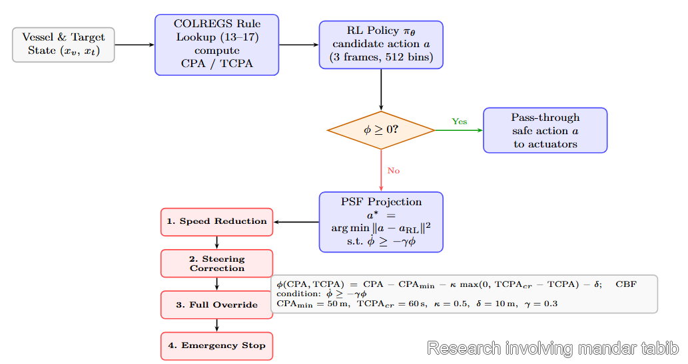 
COLREGS + RL predictive-safety-filter decision flow for autonomous vessels.

**Challenges we worked to mitigate in multi-turn agent loops:** LLM and workflow latency · tool integration · reproducibility (prompt sensitivity, model choice) · verifying agents · context bloat, compaction and drift · token cost.
*Poster: "Testing Agentic AI and Hybrid Modelling for Optimization and Predictive Maintenance in Engineering", M. Tabib & A. Rasheed, SINTEF (2026). Funded by the Research Council of Norway, the EU and SINTEF (FME NorthWind, AI4HyDROP, SEP, TAPI).*
*Poster: "Agentic CFD: Building AI Agents for Physics-Based Simulation", A. Rasheed, M. Shahly, V. Tsiolakis & M. Tabib, NTNU / SINTEF Digital (2026).*

---

## Wind and Renewable Energy

<table>
<tr>
<td width="50%" align="center">
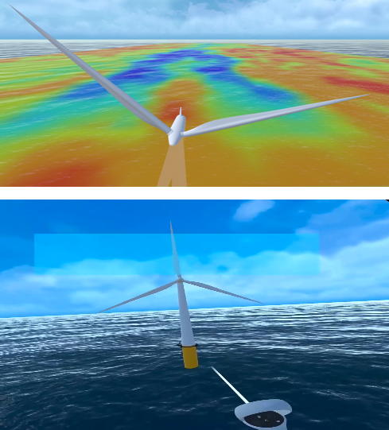 
<b>Digital twin of an offshore wind turbine</b> in Unity/VR (with NTNU), driven by AI surrogates.
</td>
<td width="50%" align="center">
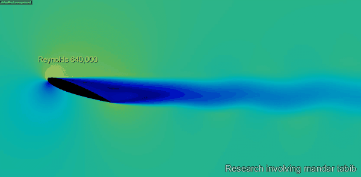 
<b>Full-order CFD vs deep-learning ROM</b> (convolutional autoencoder + LSTM) at Re = 640,000, <b>~1000× speed-up</b>.
</td>
</tr>
</table>

**What I did**
- **Develop Digital-twin enablers for offshore wind farms (FME NorthWind, WP4 lead researcher):** semi-supervised predictive maintenance on SCADA data (Autoencoder + GMM + LSTM); **safe RL with safety filters** for wake-steering power optimisation; **physics-informed generative AI (GANs) for super-resolved wind states**; hybrid surrogates for wake prediction (PCA / conv-autoencoders + RNN / Neural ODE latent dynamics).  
 Note: The Unity Digital Twin User-interface was developed in NTNU by Florian and Adil, and my enablers were developed for this digital twin. 
- **High-fidelity CFD of rotating turbines and real wind farms:** LES/RANS of the industrial-scale **Bessaker wind farm** (terrain, wakes, atmospheric stability); actuator-line vs sliding-mesh vs MRF comparisons; NREL 5 MW and marine-boundary-layer interaction; FSI (NOWITECH FME, KPN FSI-WT).
- **Reduced-order models:** POD-based data mining of near wakes and parametric ROMs of flow around blades.
- **Now:** *PreWinT* (2026–2028): an AI-enabled digital twin for **wind-turbine noise**, correcting low-order aero-acoustic models with symbolic regression.

  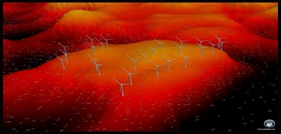
  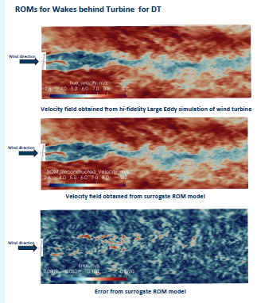
  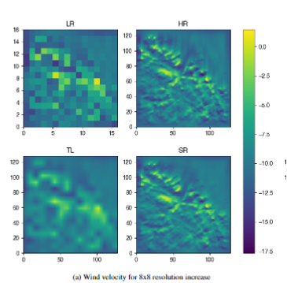

  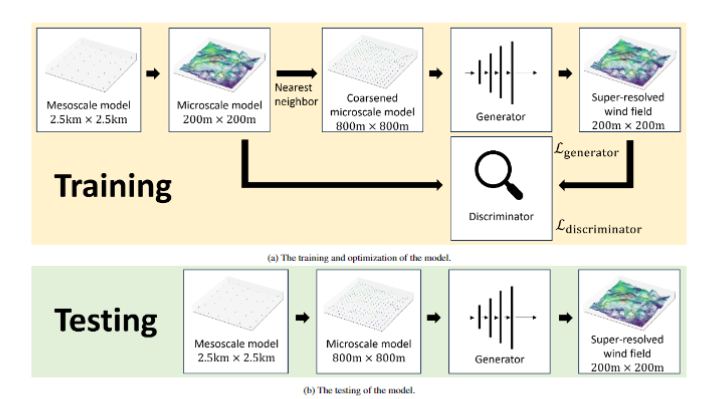
  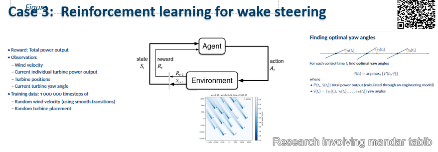
   Left to right: LES of the Bessaker farm in complex terrain · LES vs ROM wakes · GAN super-resolution (8×) of mesoscale wind · GAN training/testing · RL wake-steering set-up.

<b>📚 Peer-reviewed evidence (selected, 10+ wind publications)</b>

- Lye, **Tabib**, Johannessen, *A Reinforcement Learning framework for Wake Steering of Wind Turbines*, J. Phys.: Conf. Ser. 2626, 012051 (2023). 
- Rasheed, Stadtmann, Fonn, **Tabib** et al., *Digital Twin for Wind Energy: Latest updates from the NorthWind project*, arXiv (2024). 
- **Tabib** et al., *Hybrid deep-learning POD-based parametric reduced order model for flow around wind-turbine blade*, J. Phys.: Conf. Ser. 2362, 012039 (2022). 
- Tran, Robinson, Rasheed, San, **Tabib**, Kvamsdal, *GANs enabled super-resolution reconstruction of wind field*, J. Phys.: Conf. Ser. 1669 (2020). 
- Siddiqui, Rasheed, **Tabib**, Kvamsdal, *Numerical investigation of modeling frameworks and geometric approximations on NREL 5 MW wind turbine*, **Renewable Energy** 132 (2019). [🔎](https://scholar.google.com/scholar?q=%22Numerical+investigation+of+modeling+frameworks+and+geometric+approximations+on+NREL+5+MW+wind+turbine%22)
- **Tabib**, Siddiqui, Fonn, Rasheed, Kvamsdal, *Near wake region of an industrial scale wind turbine: comparing LES-ALM with LES-SMI simulations using data mining (POD)*, J. Phys.: Conf. Ser. 854 (2017). 
- **Tabib**, Rasheed, Siddiqui, Kvamsdal, *A full-scale 3D vs 2.5D vs 2D analysis of flow pattern and forces for an industrial-scale 5 MW NREL reference wind turbine*, Energy Procedia 137 (2017). 
- **Tabib**, Rasheed, Fuchs, *Analyzing complex wake-terrain interactions and its implications on wind-farm performance*, J. Phys.: Conf. Ser. 753 (2016). 
- **Tabib**, Rasheed, Kvamsdal, *Investigation of the impact of wakes and stratification on the performance of an onshore wind farm*, Energy Procedia 80 (2015). 
- **Tabib**, Rasheed, Kvamsdal, *LES and RANS simulation of onshore Bessaker wind farm: analysing terrain and wake effects*, J. Phys.: Conf. Ser. 625 (2015). 
- *Also:* Siddiqui et al., J. Phys. Conf. Ser. 753 (2016) [DOI](https://doi.org/10.1088/1742-6596/753/3/032059) · van Opstal et al., *Isogeometric methods for CFD and FSI of turbine blades*, Energy Procedia 80 (2015) [DOI](https://doi.org/10.1016/j.egypro.2015.11.448) · Siddiqui et al., *Offshore vertical-axis turbine*, Energy Procedia 80 (2015) [DOI](https://doi.org/10.1016/j.egypro.2015.11.435) · Fonn et al., *ROM of wake flows using POD*, Energy Procedia 137 (2017) · four OMAE/AIAA 2017 papers on wind farms & ocean–met coupling.

**Projects:** FME NorthWind (RCN) · PreWinT (RCN KSP) · NOWITECH FME · KPN FSI-WT · SEP Agentic AI. **Partners:** Statkraft, Equinor, TrønderEnergi, Hydro Energi, wind-farm operators.

---

## Low-Carbon Process Design and Hydrogen

<table>
<tr>
<td width="34%" align="center">
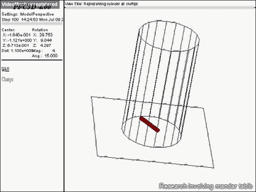 
<b>CFD-DEM:</b> building industrial-scale packed beds particle by particle.
</td>
<td width="22%" align="center">
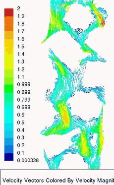 
Resolved flow through the DEM-generated bed.
</td>
<td width="44%" align="center">
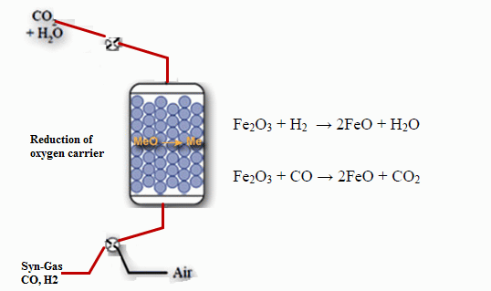 
<b>Chemical looping combustion:</b> oxygen carrier cycles between reduction by syngas (H₂/CO) and oxidation, with inherent CO₂ capture.
</td>
</tr>
</table>

**What I did**
- **Hydrogen storage, thermal state estimation:** a deep-learning **hybrid POD-LSTM surrogate** that reconstructs natural-convection temperature fields in storage enclosures in real time.
- **Hydrogen-material susceptibility (exploratory):** ML surrogates that estimate embrittlement indices of alloys from composition and processing features, replacing slow, costly experiments.
- **Syngas (H₂/CO) chemical-looping combustion with CO₂ capture (EU DemoCLOCK, 500 kW):** a multiscale workflow in which 3D CFD-DEM of real pellet shapes (spheres, fluted rings, cylinders) supplies closures (Δp, heat and mass transfer, porosity) to a **1D multi-domain particle-reactor model**. This helps select oxygen-carrier shapes that minimise pressure drop, maximise conversion and avoid fuel slip.
- **Towards green-H₂ metallurgy:** multiphase reactive CFD of smelting where CO/H₂ post-combustion drives reduction; see the HIsmelt work under [Process industry](#process-industry-and-oil-and-gas).

  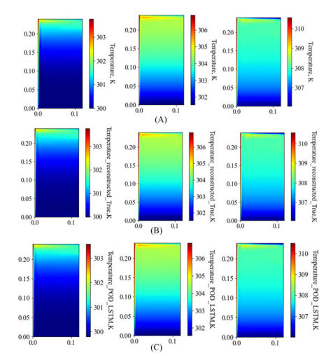
  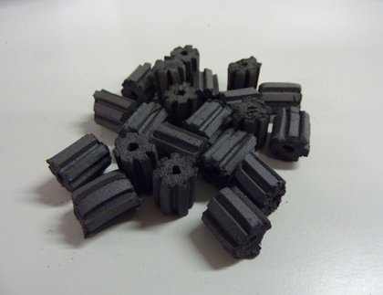
   
  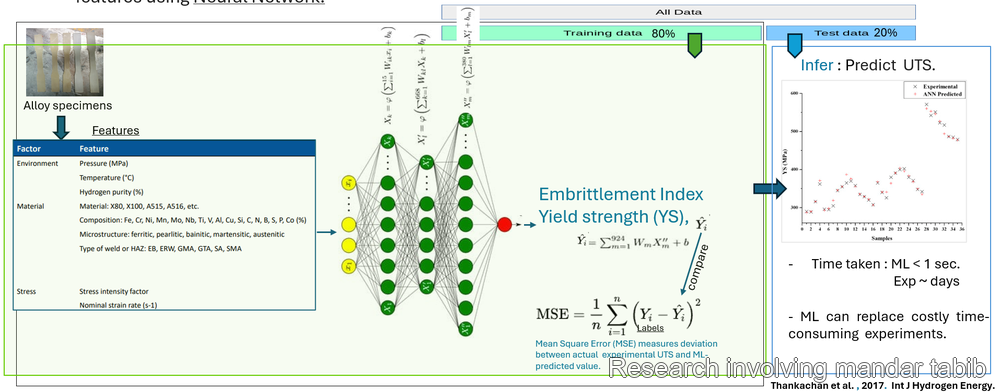

<b>📚 Peer-reviewed evidence</b>

- Ganguli, **Tabib**, Deshpande, Raval, *Deep learning-based hybrid POD-LSTM framework for laminar natural convection flow in a rectangular enclosure*, Chemical Product and Process Modeling 20(2) (2025). [🔎](https://scholar.google.com/scholar?q=%22Deep+learning-based+hybrid+POD-LSTM+framework+for+laminar+natural+convection+flow%22)
- Ganguli, **Tabib**, Deshpande, Dhotre, *Role of mathematical modeling in advanced power generation systems*, **Frontiers in Energy Research** 11, 1301851 (2023). [🔎](https://scholar.google.com/scholar?q=%22Role+of+mathematical+modeling+in+advanced+power+generation+systems%22)
- **Tabib**, Johansen, Amini, *A 3D CFD-DEM methodology for simulating industrial scale packed bed chemical looping combustion reactors*, **Ind. Eng. Chem. Res.** 52(34) (2013). 
- **Tabib**, Morud, Johansen, Amini, *A multi-domain 1D particle-reactor model for packed bed reactor applications*, Progress in Applied CFD, SINTEF Proceedings (2015). [🔎](https://scholar.google.com/scholar?q=%22multi-domain+1D+particle-reactor+model+for+packed+bed%22)
- Stephens, **Tabib**, Schwarz, Davis, *CFD simulation of bath dynamics in the HIsmelt smelt reduction vessel for iron production*, Progress in CFD 12(2/3) (2012). [🔎](https://scholar.google.com/scholar?q=%22CFD+simulation+of+bath+dynamics+in+the+HIsmelt+smelt+reduction+vessel%22)

---

## Digital Twin Enablers: Greenhouse Example

<table>
<tr>
<td width="45%" align="center">
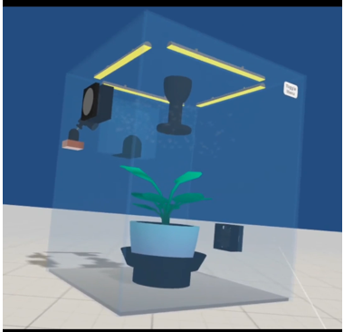 
<b>Unity 3D digital twin</b> of the NTNU lab greenhouse (IoT + Azure).
</td>
<td width="55%" align="center">
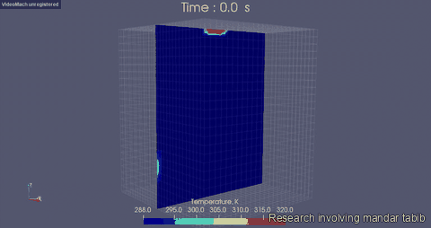 
Spatio-temporal <b>temperature evolution</b> computed by CFD and learned by a hybrid surrogate.
</td>
</tr>
</table>

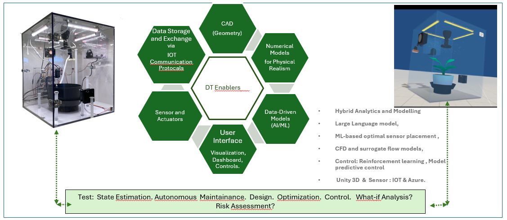 
Digital-twin enablers of the greenhouse: physical asset ↔ virtual twin, with hybrid modelling, LLM agents, optimal sensor placement, CFD surrogates, RL/MPC control, and Unity 3D + IoT/Azure.

**What research was done** *(project manager & lead researcher, 2023–2024, with NTNU Cybernetics)*
- **Reconstruct the full 3D temperature field from only 10 sparse sensors:** POD basis functions plus QR-pivoted **optimal sensor placement**, trained offline on physics simulations and run online.
- **Hybrid modelling** of spatio-temporal temperature evolution, and **control** via reinforcement learning, model-predictive control and **LLM agents**.
- The full digital-twin stack: sensors → IoT/Azure → Unity 3D visualisation → state estimation, what-if analysis and autonomous maintenance. I supervised three MSc theses and helped set up the lab.

  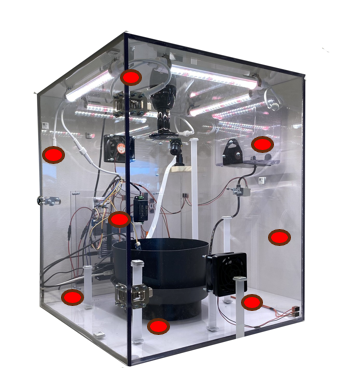
  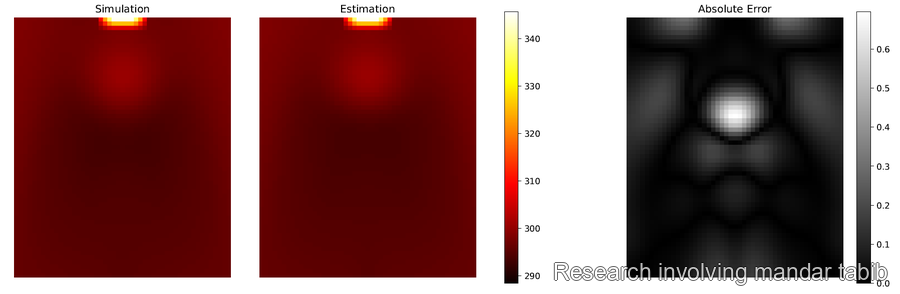
   Physical asset with optimally placed sensors (red) · offline/online sparse-sensor reconstruction workflow.

<b>📚 Peer-reviewed evidence</b>

- **Tabib**, Rasheed, Skare, Bruaset, *Data-driven spatio-temporal modelling and optimal sensor placement for a digital twin set-up*, Engineering Proceedings 39(1), 98 (2023). 
- Sundby, Graham, Rasheed, **Tabib**, San, *Geometric change detection in digital twins* (DMD + YOLOv5 + 3D pose estimation), **Digital** 1(2) (2021). 

---

## Process Industry and Oil and Gas

<table>
<tr>
<td width="62%" align="center">
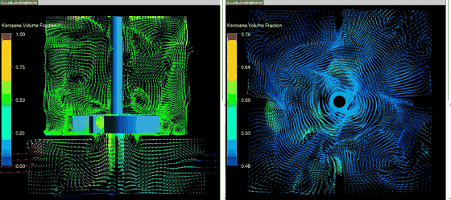 
<b>Large-eddy simulation of a solvent-extraction pump-mixer</b> (Cu/Ni/Co hydrometallurgy): impeller-driven vortices and turbulence.
</td>
<td width="38%" align="center">
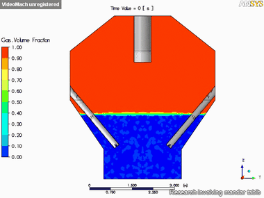 
<b>HIsmelt iron smelting (Rio Tinto)</b>: gas–liquid–solid reactive bath dynamics at 1450 °C.
</td>
</tr>
<tr>
<td width="62%" align="center">
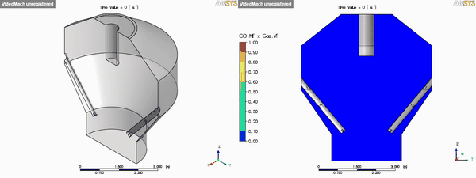 
Euler–Euler + Lagrangian particles + free surface: coal injection and CO generation.
</td>
<td width="38%" align="center">
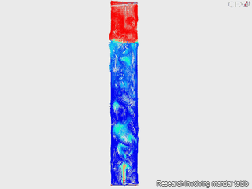 
Gas–liquid <b>bubble column</b>: inter-phase forces and turbulence models.
</td>
</tr>
</table>

**What I did**
- **Hybrid AI for drilling (KPN Hole Cleaning, Big Pressure; WP manager):** *learned corrections* of a physics-based 1D multiphase cuttings-transport model using along-string sensor data, both **intrusive (in-code)** and non-intrusive, **with uncertainty quantification**. In our comparison **LSTM (MSE 2.1×10⁻⁶) beat a Transformer (20.1×10⁻⁶)** for bottom-hole ECD correction. The work also covers real-time anomaly detection (Isolation Forest to LSTM-autoencoders), continual learning and drift monitoring, and **Bayesian PINNs for pore-pressure prediction** (multi-modal well logs + simulations).
- **Multiphase and reactive CFD for design:** bubble columns, pump-mixers (LES with sub-grid-scale dispersion models), iron smelting, packed-bed reactors, CFD-DEM.
- **Unsupervised ML on flow physics, since my PhD:** snapshot POD and hybrid **POD-wavelet** analysis to identify the dominant coherent structures that drive transport in process equipment.
- **ML for materials:** tree-based, linear and neural models for discovering thermo-electric materials from sparse data.
- **Agentic optimisation of aluminium electrolysis:** see the [Agentic AI flagship](#agentic-ai-and-hybrid-modelling-four-cases).

  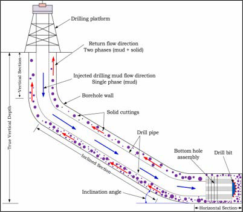
  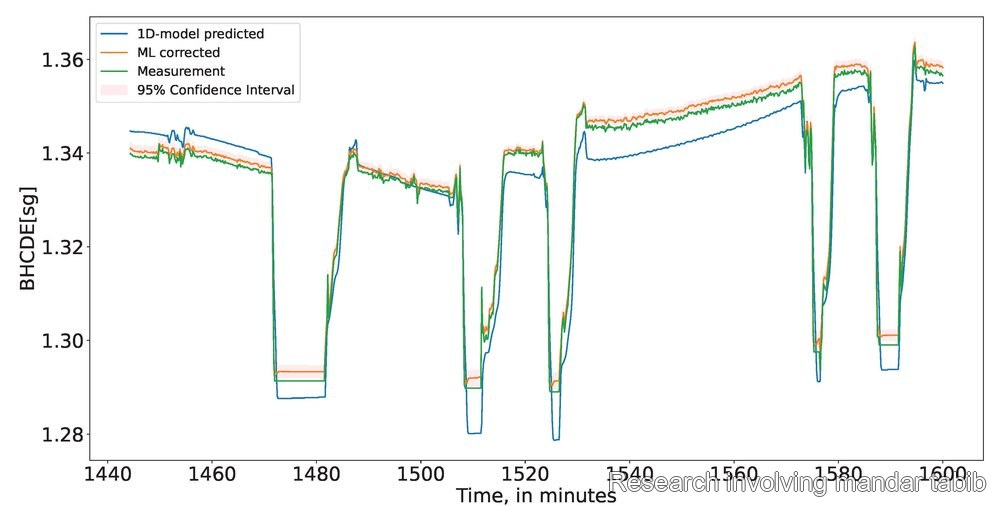
   Wellbore cuttings transport · 1D-physics prediction vs <b>ML-corrected hybrid</b> vs measurement, with 95 % confidence band.

<b>📚 Peer-reviewed evidence (selected)</b>

*Oil & gas / drilling (hybrid AI)*
- **Tabib**, Nivlet, Steinar, Skogestad, Nybø, Rasheed, *An intrusive hybrid-analytics and modelling with deep learning for efficient and accurate predictions of hole-cleaning during wellbore drilling simulations*, SPE EuropEC (2023). 
- **Tabib**, Rasheed, *Multivariate time-series methods with uncertainty estimation for correcting physics-based model: comparisons and generalization for industrial drilling process*, AIAI 2024, IFIP AICT, Springer (2024). 
- Altindal, Nivlet, **Tabib**, Rasheed et al., *Anomaly detection in multivariate time series of drilling data*, **Geoenergy Science and Engineering** 237 (2024). 
- **Tabib** et al., *A hybrid approach to detect bad hole cleaning*, ASME OMAE (2023). 
- Nivlet et al., *Towards real-time bad hole cleaning problem detection through adaptive deep learning models*, MEOS GEO (2023). 
- Altindal, Rasheed, **Tabib**, Nybø, *Online parameter calibration in drilling hydraulics model*, SPE Gas & Oil Technology (2025). · **Tabib**, Rasheed, Fuchs, *Unsteady hydrodynamics of vortex-induced vibrations on a bluff-bodied offshore structure*, OMAE (2017).

*Process industry (CFD + unsupervised ML)*
- **Tabib**, Roy, Joshi, *CFD simulation of bubble column: an analysis of interphase forces and turbulence models*, **Chem. Eng. J.** 139(3) (2008), 100+ citations. 
- Joshi, **Tabib**, Deshpande, Mathpati, *Dynamics of flow structures and transport phenomena, 1 & 2*, **Ind. Eng. Chem. Res.** 48(17) (2009).  
- **Tabib**, Schwarz, *Quantifying sub-grid scale turbulent dispersion force using one-equation SGS LES in gas–liquid and liquid–liquid systems*, **Chem. Eng. Sci.** 66(14) (2011). 
- **Tabib**, Lane, Yang, Schwarz, *CFD study of single-phase and multiphase (liquid–liquid) pump-mixer*, **Chem. Eng. Sci.** 80 (2012). [🔎](https://scholar.google.com/scholar?q=%22CFD+study+of+single+phase+and+multiphase+%28liquid-liquid%29+pump-mixer%22)
- **Tabib**, Sathe, Deshpande, Joshi, *A hybridized snapshot POD–discrete wavelet transform technique for the analysis of flow structures*, **Chem. Eng. Sci.** 64(21) (2009). [🔎](https://scholar.google.com/scholar?q=%22hybridized+snapshot+proper+orthogonal+decomposition-discrete+wavelet+transform%22)
- **Tabib**, Joshi, *Analysis of dominant flow structures in chemical process equipment using snapshot POD*, **Chem. Eng. Sci.** 63(14) (2008). [🔎](https://scholar.google.com/scholar?q=%22Analysis+of+dominant+flow+structures+and+their+flow+dynamics+in+chemical+process+equipment%22)
- Dhotre, Nere, Vedantam, **Tabib**, *Advances in computational fluid dynamics*, Int. J. Chem. Eng. (2013). 
- **Tabib** et al., *Discovering thermo-electric materials using machine learning: insights and challenges*, LNCS 11139, Springer (2018). 
- *Also:* Deshpande, **Tabib** et al., J. Turbulence 11 (2010) · **Tabib** et al., J. Computational Multiphase Flows 2(3) (2010).

**Partners:** Aker BP · Equinor · Rio Tinto / CSIRO Minerals · RCN KPN projects.

---

## Aviation Safety and Defense

<table>
<tr>
<td width="62%" align="center">
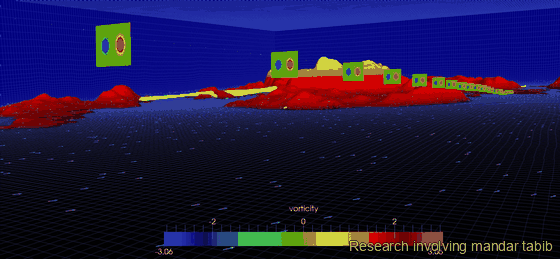 
<b>Aircraft wake-vortex</b> transport and decay along the approach path (EU SESAR).
</td>
<td width="38%" align="center">
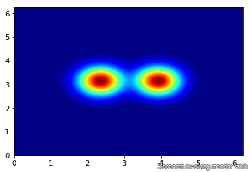 
<b>Nudged hybrid model:</b> a Galerkin ROM with LSTM residual correction assimilates sparse LIDAR/RADAR data in real time.
</td>
</tr>
</table>

**What I did**
- **Real-time wake-vortex monitoring (EU SESAR, WP manager, 2014–2020):** ML-based data assimilation using an **ensemble Kalman filter with ML nudging**, which fuses sparse, noisy sensor data with imperfect reduced-order physics for optimal state estimation of vortex location. This directly supports runway throughput and safety.
- **Airport flight-safety analysis at 10+ Norwegian airports for Avinor (PI, 2015–2020):** high-resolution CFD of **terrain- and building-induced turbulence and wind shear** at Stavanger-Sola, Bodø, Kristiansund, Gimsøya, Sandane and Ørsta-Volda, plus new airport siting. Twelve SINTEF reports delivered safety recommendations for critical infrastructure decisions.
- **Deep-learning ROMs for aerofoils** (see the video below).

  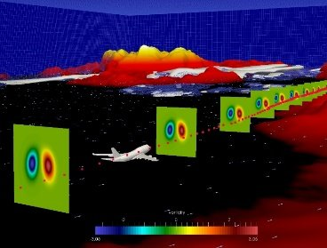
  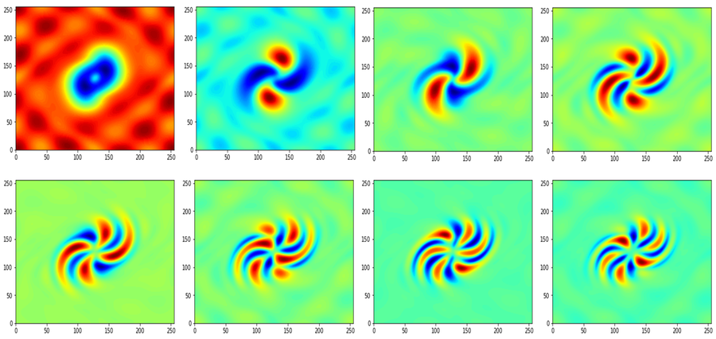

  
   ▶️ <b>Airfoils: deep-learning & POD-based non-intrusive parametric reduced-order model</b> (YouTube)

<b>📚 Peer-reviewed evidence</b>

- Ahmed, Pawar, San, Rasheed, **Tabib**, *A nudged hybrid analysis and modeling approach for real-time wake-vortex transport and decay prediction*, **Computers & Fluids** 221, 104895 (2021). 
- **Tabib**, Tsiolakis, Ahmed, Pawar, San, Rasheed, *Deep-learning and POD-based non-intrusive parametric ROM for flow around airfoils and wind-turbine blade*, J. Phys.: Conf. Ser. (2022). 
- **Tabib**, Rasheed, Kvamsdal, *High-resolution CFD modelling and prediction of terrain-induced wind shear and turbulence for aviation safety* (2019). [🔎](https://scholar.google.com/scholar?q=%22terrain+induced+wind+shear+and+turbulence+for+Aviation+safety%22)
- 12 SINTEF technical reports for Avinor and EU SESAR 12.2.2 (wake-vortex micro-scale turbulence), 2014–2016.

---

## Drones and Autonomous Ships

<table>
<tr>
<td width="50%" align="center">
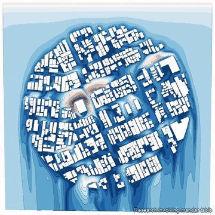 
<b>① AI predicts urban wind and turbulence in seconds</b> (ML reduced-order model trained on multiscale CFD).
</td>
<td width="50%" align="center">
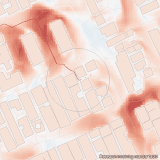 
<b>② A reinforcement-learning drone plans a path</b> that avoids the high-turbulence zones and obstacles.
</td>
</tr>
</table>

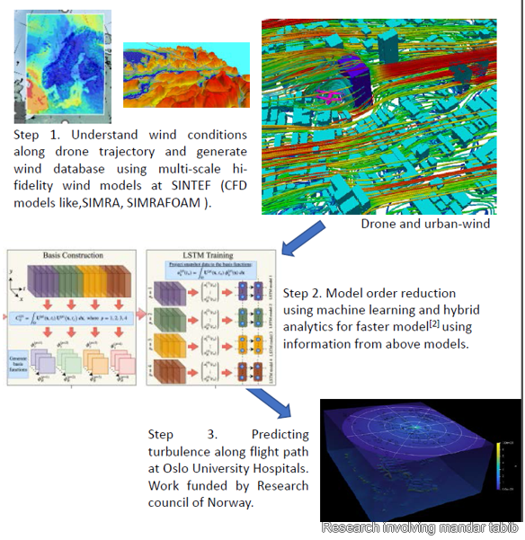 
Multiscale CFD (HARMONIE → SIMRA → building-resolved) → <b>ML reduced-order model</b> → turbulence along flight paths (hospital drone logistics).

**What I did**
- **AI4HyDROP (EU SESAR, 2023–2025, SINTEF lead):** an AI safety framework for urban drone operations. **Physics-informed ML flow models compute urban turbulence in seconds**, which feeds **risk-aware RL path planning** and model-free control in turbulent cities.
- **ATB, drones for medical transport between hospitals (RCN, WP manager):** hybrid analytics (ML + CFD) for real-time parametric urban wind prediction, using a **Grassmann-manifold deep-learning ROM**.
- **Autonomous vessels (EU EDF dThor, 2022–2025):** ML-enhanced Kalman sensor fusion with adaptive noise, **RL + Predictive Safety Filter for COLREGS-compliant collision avoidance**, and LSTM remaining-useful-life for propulsion health. This is now extended into the **ShipAgent** multi-agent RAMS framework ([repo](https://github.com/mandar-tabib-1/ShipAgent-RAMS)).

  
  
   ▶️ <b>AI for wind & turbulence</b> (conference talk, 2025) · ▶️ <b>Deep-learning parametric ROM for urban flow</b>

<b>📚 Peer-reviewed evidence</b>

- Larsen, **Tabib**, Rasheed, *Resource-constrained dynamic planning and model-free control in turbulent urban environments*, **Robotics and Autonomous Systems**, 105130 (2025). 
- **Tabib**, Rasheed, *Machine learning based wind and turbulence prediction at urban-scale for drone operations*, Big Data & AI (BDA 2025), LNCS, Springer (2026). 
- **Tabib**, Pawar, Ahmed, Rasheed, San, *A non-intrusive parametric reduced order model for urban wind flow using deep learning and Grassmann manifold*, J. Phys.: Conf. Ser. 2018, 012038 (2021). 
- **Tabib**, Midtbø, Skaslien, Rasheed, Kvamsdal, *Towards understanding wind impact for drone operations: comparison of wind models on different scales in a nested multiscale set-up*, CFD 2020, SINTEF Proceedings (2020). [🔎](https://scholar.google.com/scholar?q=%22Towards+understanding+wind+impact+for+drone+operations%22)

---

## Smart City, Urban Climate, Mobility and Health

<table>
<tr>
<td width="44%" align="center">
 
<b>Building-resolved urban wind</b> used for pedestrian comfort, drone safety and wind-energy siting.
</td>
<td width="56%" align="center">
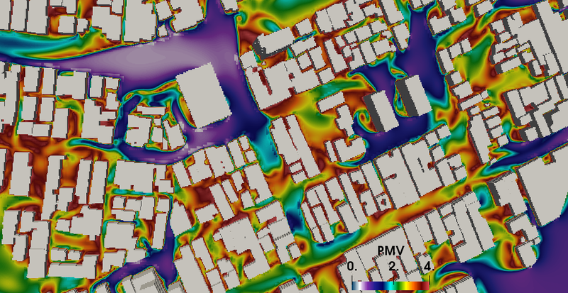 
Physics-based <b>thermal comfort (PMV)</b> for cycling routes, a follow-up to ML predictions of bike traffic.
</td>
</tr>
</table>

**What I did**
- **ML with subsequent physics-based analytics for transport planning (DIGMOB, AI-CLIMAMOB; RCN):** regression, SVR, random forest, ANN and LSTM on Oslo cycle-counter and weather data. Interpretable weather drivers of mobility are then turned into **CFD-based comfort maps** that guide where new bike infrastructure should go.
- **Nested multiscale urban wind (meso → micro, LES vs RANS)**, validated against masts at Rikshospitalet, Oslo.
- **Health:** CFD + unsupervised ML (POD) for **carotid-artery stenosis** disease progression (CarotidML).

  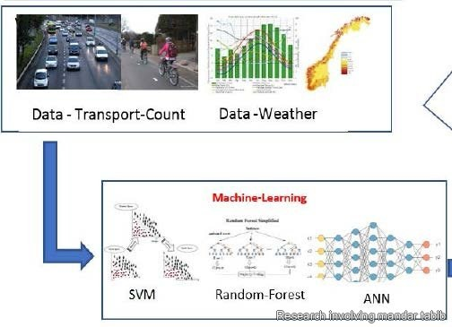
  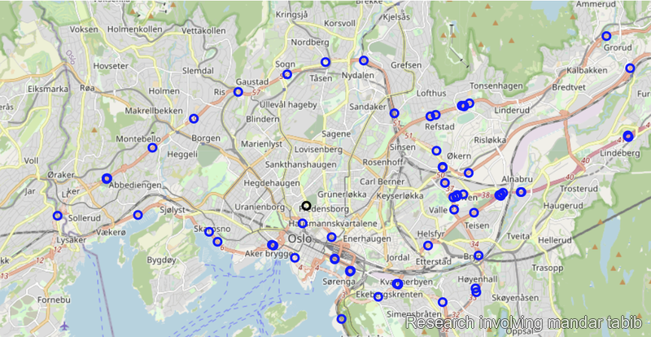
  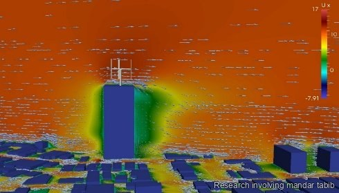

<b>📚 Peer-reviewed evidence</b>

- **Tabib**, Rasheed, Uteng, *Machine learning with subsequent physics-based analytics for guiding transport planning*, IEEE ICAPAI (2021). [🔎](https://scholar.google.com/scholar?q=%22Machine+learning+with+subsequent+physics-based+analytics+for+guiding+transport+planning%22)
- **Tabib**, Midtbø, Rasheed, Kvamsdal, Skaslien, *A nested multi-scale model for assessing urban wind conditions: LES vs RANS at the finest scale*, J. Phys.: Conf. Ser. 2018, 012039 (2021). 
- **Tabib**, Rasheed, Uteng, *Methodology for assessing cycling comfort during a smart city development*, Energy Procedia 122 (2017). [🔎](https://scholar.google.com/scholar?q=%22Methodology+for+assessing+cycling+comfort+during+a+smart+city+development%22)
- **Tabib**, Fonn, Rasheed, *A computational framework involving CFD and data mining tools for analyzing disease in carotid artery bifurcation*, Progress in Applied CFD, SINTEF Proceedings (2017). [🔎](https://scholar.google.com/scholar?q=%22CFD+and+data+mining+tools+for+analyzing+disease+in+carotid+artery+bifurcation%22)

---

## Material Science

**Discovering thermoelectric materials with machine learning + density functional theory (DFT)** *(MLFunc project, 2018; WP manager and lead researcher; SINTEF Digital with SINTEF Industry; SEP funding)*

Thermoelectric (TE) materials turn waste heat directly into electricity, but finding new ones means searching an almost limitless space of chemical compounds with slow experiments or very expensive DFT. We combined **physics-based DFT (+ Boltzmann transport theory)** with **data-driven ML** to screen new candidates by their figure of merit **ZT**, and studied how well ML generalises when data is scarce.

- **Data:** 115 DFT-computed compounds × 51 chemical potentials × 15 temperatures = **87,975 data points**, each with **50 descriptors** (atomic mass, radius, electronegativity, valence electrons, periodic-table features, crystal shape). The trained models then screened an unseen search space of **4,800 silicide compounds** (240,312 data points).
- **Train/test design:** models were trained on some compounds and tested on *unseen compounds*. Three splits were compared: two random and one deterministic and balanced. The split changed generalisation strongly, even after cross-validation.
- **Random Forest (RF) vs Deep Neural Network (DNN) on unseen compounds:**

| Test R² (unseen compounds) | Case 1 (random) | Case 2 (random) | Case 3 (balanced) |
|---|---|---|---|
| **Random Forest** | 0.82 | 0.23 | **0.76** |
| Deep neural network | 0.20 | −0.14 | 0.45 |

- ✅ **With limited data, the simpler RF generalised better** than the DNN, which overfitted (train R² ≈ 0.97, test R² as low as −0.14) and sometimes gave physically unrealistic ZT profiles.
- ✅ **Candidates found:** RF, trained on the balanced split, proposed simple silicides such as **Li₂MgSi**, close to the Mg₂LiSi family under experimental investigation, plus SrMgSi. The DNN preferred complex compounds (more than 3 elements) that are hard to make and verify. Both models identified BeSiIr₂.
- ✅ **Computational saving:** DFT alone needs about **85 CPU-hours per compound** (≈ 408,000 CPU-hours for 4,800 compounds). Screening those 4,800 compounds takes the trained model **80 s (RF) or 132 s (DNN)**, and the whole DFT + ML workflow costs **about 2 %** of DFT alone.

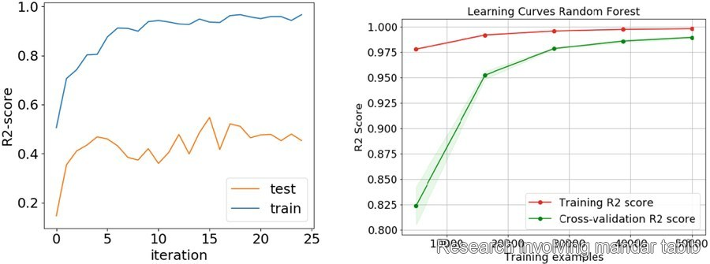 
Bias–variance check: DNN learning curve (left, train vs test R²) and Random Forest learning curve (right).

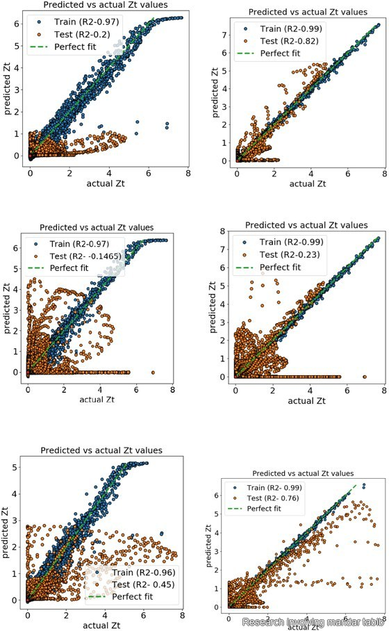
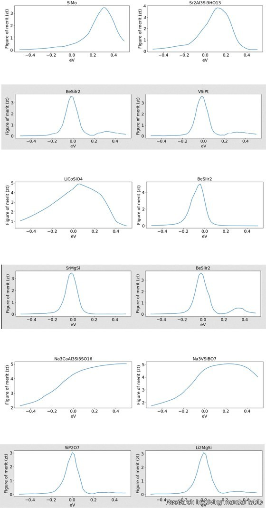 
Left: predicted vs actual ZT on training and unseen test compounds for the three splits (DNN left column, RF right column). Right: best two candidate silicides found by DNN (left) and RF (right); ZT vs chemical potential (eV).

<b>📚 Peer-reviewed evidence</b>

- **Tabib**, Løvvik, Johannessen, Rasheed, Sagvolden, Rustad, *Discovering thermo-electric materials using machine learning: Insights and challenges*, **Lecture Notes in Computer Science** 11139, pp. 392–401, Springer (ICANN 2018). 
- *Related:* ML surrogates for hydrogen-material susceptibility (see [Low-Carbon Process Design and Hydrogen](#low-carbon-process-design-and-hydrogen)).

---

## 🧰 Method toolbox: Hybrid Analysis & Modelling for digital twins

<table>
<tr>
<td width="42%" align="center"></td>
<td width="58%" valign="top">

| HAM method | Where I've used it |
|---|---|
| Physics-guided ML / **PINNs** (incl. Bayesian UQ) | Pore pressure, wind |
| **Learned correction** of imperfect physics | Drilling 1D model, wake-vortex ROM |
| **Parametric ROM**: POD / autoencoder + LSTM / Neural ODE / Grassmann | Wind, airfoils, urban flow, H₂ storage |
| **Equation discovery**: SINDy, symbolic regression | Aluminium (COSTA-SINDy), turbine noise |
| **Sparse sensing** & optimal sensor placement | Greenhouse, ship engine |
| **Safe RL** with predictive safety filters | Wake steering, drones, vessels |
| **Generative AI** super-resolution (GAN, diffusion) | Wind-field state estimation |
| **ML data assimilation**: EnKF + nudging | Aviation wake vortices |
| **Agentic AI**: LLM orchestration + verifiers | Wind farm, aluminium, ships, **agentic CFD (OpenFOAM)** |

</td>
</tr>
</table>

  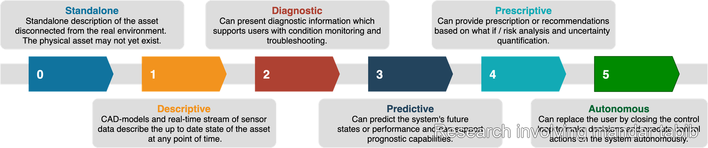
   Digital-twin capability levels, from standalone to autonomous (Stadtmann, Rasheed, …, 2023). My work targets the predictive → autonomous levels.

  
   
  
  
  
  
  

---

## 🎓 Education & career

| Period | Role / degree | Highlights |
|---|---|---|
| **2022 – now** | Senior Research Scientist, **SINTEF Digital**, Norway | Agentic AI, digital twins, hybrid AI; project & WP manager (RCN, EU SESAR, EU EDF) |
| 2011 – 2021 | Research Scientist, **SINTEF Digital & Industry**, Norway | Wind energy CFD/ROM, aviation safety, drilling hybrid AI, CO₂-capture reactors |
| 2008 – 2011 | **OCE Post-Doctoral Fellow** (Office of the Chief Executive, a prestigious fellowship), **CSIRO**, Melbourne, Australia | Multiphase LES, iron smelting (Rio Tinto HIsmelt), solvent-extraction pump-mixers |
| 2004 – 2008 | **Ph.D. Chemical Engineering**, Institute of Chemical Technology, Mumbai, India | *Unsupervised machine learning + CFD to identify flow-structure dynamics in industrial processes* (supervisor Prof. J. B. Joshi). Six journal papers; nominated for best-thesis award |
| 2002 – 2004 | **M.E. Chemical Engineering**, BITS Pilani, India (CGPA 9.3/10) | Thesis: *AI for fault classification with Support Vector Machines + genetic algorithms* on the Tennessee Eastman benchmark (52 sensors) |
| 1997 – 2001 | B.E. Chemical Engineering, Pune University (Distinction) | |

**Teaching & mentoring:** supervised or mentored **6 PhD** candidates (NTNU; Oklahoma State University, USA) and **8 MSc** theses, one of which won a best-MSc-thesis award (OpenAI Lab, NTNU). Mentored a post-doc (NOWITECH). Taught at the Geilo Winter School (*Practical Machine Learning*, 2017). Contributed to NTNU courses TTK4260 (Multivariate Data Analysis) and TTK29 (Hybrid Analysis & Modelling for Digital Twins). External examiner for 15+ AI theses. Journal co-editor (2×) and frequent reviewer in wind energy and applied AI.

---

## 🎬 Research videos

<!-- VIDEOS:START -->

<!-- VIDEOS:END -->

## 🗂️ Latest open-source repositories

<!-- REPOS:START -->
| Repository | Description |
|---|---|
| [ShipAgent-RAMS](https://github.com/mandar-tabib-1/ShipAgent-RAMS) | Testing Collision Safety and Predictive Maintenance along with Sensor Reliability for Autonomous Vessels using Agents and LLM. |
| [PowerLift-WindTurbine](https://github.com/mandar-tabib-1/PowerLift-WindTurbine) | — |
| [GNN-FM](https://github.com/mandar-tabib-1/GNN-FM) | — |
| [Python_AI_Prague](https://github.com/mandar-tabib-1/Python_AI_Prague) | AI for wind and turbulence along segment of prague city. |
| [ROM_Prague](https://github.com/mandar-tabib-1/ROM_Prague) | — |
| [HAM_win](https://github.com/mandar-tabib-1/HAM_win) | — |
<!-- REPOS:END -->

---

## 🤝 Let's collaborate

I'm keen to work with **industry, universities and research partners** on:

- 🔬 **Trustworthy hybrid AI**: physics + ML with uncertainty quantification for safety-critical systems
- 🧩 **Digital twins**: from sensors and surrogates to prescriptive and autonomous operation
- 🤖 **Agentic AI for science and engineering**: LLM agents that orchestrate simulators, optimisers and verifiers
- 🌊 **CFD and reduced-order modelling** for energy, process, aviation and urban applications
- 📝 **Joint proposals** (Horizon Europe, RCN, SESAR, EDF), co-supervision of PhD/MSc students, and industrial R&D contracts

  
  

  🔎 = find on Google Scholar · DOI badges link to the publisher version · results shown are from peer-reviewed papers, project deliverables and SINTEF posters/presentations.

---

## Acknowledgement

The author, Mandar Tabib, acknowledges the support of:

1. **Funding agencies**, including the European Union (EU SESAR, EU EDF) and the Research Council of Norway, among others, for supporting his research.
2. **His research collaborators**, who enabled his learning and tool development through data sharing and knowledge sharing. They have been duly acknowledged as co-authors in the joint publications referenced here.
3. **His employer, SINTEF, and NTNU**, for providing the computational infrastructure for tool development.
4. **LLM Agents** like Claude for helping render this readme using his own published research.

  © Mandar Tabib / SINTEF. Figures and animations are shown to illustrate published and project research. Please do not reuse or redistribute them without permission; when referring to the work, cite the associated publications.

  

